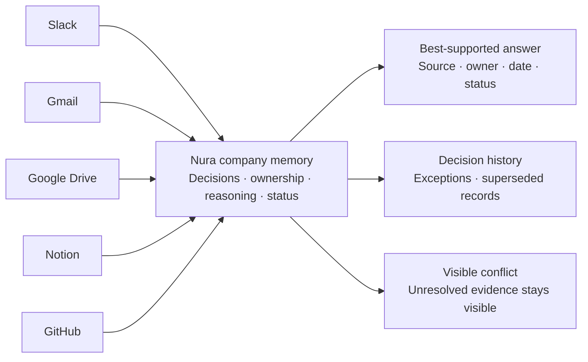

# Nura

Most companies do not lose information.

They lose the ability to tell **which version of it still holds**.

A policy may live in Google Drive. An exception may be approved in Slack. A customer commitment may sit in Gmail. The reasoning behind a technical decision may be buried in GitHub. A later update may exist in Notion.

All of those records can still be searchable — while only one of them may answer the question being asked.

**Nura is an AI company memory layer built for that problem.**

It evaluates approved workplace evidence to identify the **best-supported decision**, while keeping the source, reasoning, owner, date, status, exceptions, and unresolved conflict attached.

> **Search finds documents. Nura remembers decisions.**

---

## The idea in one picture



Nura is not designed to flatten every source into one giant search index.

It is designed to answer a narrower, more operational question:

> **What was decided, who decided it, why, and does it still apply?**

---

## What a Nura answer looks like

<table>
<tr>
<td width="58%" valign="top">

<sub>QUESTION</sub>

### What discount can Sales approve without Finance sign-off?

<br>

<sub>BEST-SUPPORTED ANSWER</sub>

## Up to 15%

Sales can approve discounts of up to **15%** without Finance sign-off.

The 20% Slack approval was a temporary account exception. The older 25% planning record was superseded by the later policy.

</td>
<td width="42%" valign="top">

<sub>DECISION RECORD</sub>

**Owner**  
VP Sales

**Status**  
`Still in effect`

**Evidence**  
`Google Drive` Pricing Policy  
`Slack` #sales  
`Planning` Quarterly notes

**History**  
`20%` temporary exception  
`25%` superseded proposal

</td>
</tr>
</table>

<sub>Illustrative example. Company and decision data shown here is for demonstration only.</sub>

> The answer matters. **The record behind the answer is what makes it company memory.**

---

## What Nura remembers

| Memory | What Nura is looking for |
|---|---|
| **Decisions** | What the company actually decided |
| **Approvals** | Who signed off and under what conditions |
| **Exceptions** | One-off approvals that should not silently become policy |
| **Policies** | The standard that is currently best supported |
| **Ownership** | The person or team responsible |
| **Reasoning** | Why the decision was made |
| **Timing** | When the decision became relevant |
| **Status** | Whether it still holds, expired, or was superseded |
| **Conflict** | Where approved sources still disagree |
| **Provenance** | The original evidence behind the answer |

---

## How Nura works

### 01 — Connect approved sources

Connect the workplace systems where decisions and context already live.

### 02 — Capture decisions and context

Nura looks for approvals, policies, exceptions, ownership, commitments, and operating context instead of treating every record as equally important.

### 03 — Structure company memory

Relevant evidence is organized around what was decided, who owned it, when it happened, and why it matters.

### 04 — Resolve conflict

When sources disagree, Nura evaluates signals such as recency, authority, ownership, scope, and later changes.

### 05 — Recall sourced answers

When the evidence is sufficient, Nura returns the best-supported answer together with its provenance.

### 06 — Keep memory current

As supported sources synchronize new information, Nura can update the company record instead of leaving an outdated answer as the default.

<p align="center">
  <a href="https://asknura.io/how-it-works"><strong>See the full Nura workflow →</strong></a>
</p>

---

## Connected sources

Nura separates connections by **who owns and authorizes the source**.

<table>
<tr>
<td width="50%" valign="top">

### Personal

Connected for an individual user's own working context.

- Gmail
- Firefly
- Outlook
- Google Calendar
- Google Drive
- OneDrive
- Zoom

</td>
<td width="50%" valign="top">

### Organizational

Connected as shared company systems and workspace knowledge.

- Slack
- Microsoft Teams
- SharePoint
- Notion
- Confluence
- GitHub
- Jira
- Linear
- Asana
- ClickUp
- HubSpot
- Salesforce
- Zendesk
- Intercom

</td>
</tr>
</table>

<sub>Connector behavior, permissions, and available data depend on the authorization model and source configuration.</sub>

<p align="center">
  <a href="https://asknura.io/integrations"><strong>Explore integrations →</strong></a>
</p>

---

## The questions that used to need a person

### Leadership

> Which pricing policy currently applies?

Recover the policy together with the exception history, owner, effective date, and supporting source.

### Sales

> What did we promise this customer before renewal?

Bring together the approved commitment and the evidence behind it instead of relying on one person's inbox or memory.

### Engineering

> Why did we keep the existing authentication flow?

Recover the technical decision together with the pull request, issue, discussion, owner, and later changes.

### Operations

> Who approved the current escalation process?

Trace the workflow back to the approval and the record that still supports it.

### New hires

> How does this team handle enterprise exceptions?

Give new team members access to approved operating context without separating the answer from its provenance.

---

## Provenance is part of the answer

A Nura answer is designed to preserve more than the final sentence.

```text
WHO      → owner / approver
WHY      → reasoning and context
WHEN     → timing and effective date
WHERE    → original source
STATUS   → active / expired / superseded / unresolved
```

That means an answer can be reviewed instead of merely trusted.

It also means Nura can distinguish between:

- a standard policy and a one-time exception;
- a current decision and an older proposal;
- an approved record and an unresolved disagreement;
- what the company knows and what the available evidence cannot yet prove.

Learn more about [decision provenance](https://asknura.io/decision-provenance).

---

## When sources disagree

Nura is designed **not to hide the disagreement**.

```text
Pricing Policy           15%     approved
Slack exception          20%     temporary
Quarterly planning deck  25%     older proposal
                              ↓
                         evaluate
                              ↓
Best-supported decision  15%     current policy
```

When one source is clearly newer or more authoritative, Nura can use that evidence to identify the best-supported record.

When the conflict cannot be resolved from the available evidence, the uncertainty should remain visible rather than being converted into false certainty.

---

## Company memory for people — and agents

Nura is built so company context does not have to stop at the human interface.

Compatible AI-agent workflows can use Nura's **MCP layer** to retrieve source-backed company context rather than relying only on static prompts or generic retrieval.

The goal is the same:

> **One company-memory layer. Consistent provenance. Appropriate access boundaries.**

Read more about [AI agent context](https://asknura.io/ai-agent-context-layer).

---

## Security and trust

Company memory contains information that should not become universally visible simply because it has been centralized.

Nura's early-access security posture is built around:

- **Administrator-controlled connectors** — sources are intentionally connected and can be revoked.
- **Permission-aware retrieval design** — retrieval is designed around authorized workspace and source access.
- **Tenant isolation** — customer workspace data is isolated between organizations.
- **Encrypted connector credentials** — connector access tokens are encrypted at rest.
- **Source provenance** — answers are designed to remain traceable to their supporting records.
- **Deletion workflows** — administrators can revoke connections and request deletion of synchronized data associated with them.

Nura is in **public early access**. Formal security certifications and expanded exportable audit trails are roadmap items rather than claims of current certification.

<p align="center">
  <a href="https://asknura.io/security"><strong>Security overview</strong></a>
  ·
  <a href="https://asknura.io/trust"><strong>Trust Centre</strong></a>
  ·
  <a href="https://asknura.io/privacy-policy"><strong>Privacy</strong></a>
</p>


---

## Under the hood

Nura is built as a production-oriented, multi-service application for source ingestion, structured company memory, semantic retrieval, background processing, and AI-assisted reasoning.

<details>
<summary><strong>Current core stack</strong></summary>

<br />

**Frontend**

- Next.js
- React
- TypeScript

**Backend**

- Node.js
- Express
- TypeScript
- Prisma ORM

**Data & retrieval**

- PostgreSQL as the canonical application database
- Qdrant for vector retrieval
- Redis for queue/cache infrastructure
- BullMQ for background processing

**AI & memory workflows**

- semantic retrieval
- source ranking
- structured knowledge extraction
- decision and provenance extraction
- conflict/currentness evaluation
- grounded answer generation
- MCP-compatible agent context

**Infrastructure**

- Linux
- Nginx
- PM2 / worker processes
- TLS

</details>

---


## Explore Nura

| | |
|---|---|
| **Product** | [asknura.io/product](https://asknura.io/product) |
| **How it works** | [asknura.io/how-it-works](https://asknura.io/how-it-works) |
| **Integrations** | [asknura.io/integrations](https://asknura.io/integrations) |
| **Security** | [asknura.io/security](https://asknura.io/security) |
| **Trust Centre** | [asknura.io/trust](https://asknura.io/trust) |
| **Customers** | [asknura.io/customers](https://asknura.io/customers) |
| **Resources** | [asknura.io/resources](https://asknura.io/resources) |
| **Compare** | [asknura.io/compare](https://asknura.io/compare) |
| **FAQs** | [asknura.io/faq](https://asknura.io/faq) |

---

## Contact

**General**  
[hi@asknura.io](mailto:hi@asknura.io)

**Security**  
[security@asknura.io](mailto:security@asknura.io)

---

<div align="center">
  <strong>The memory layer for your company.</strong>
  <br />
  <sub>© 2026 Nura, Inc. A product of Wagwan Studios and Indus Technology Corporation.</sub>
</div>
